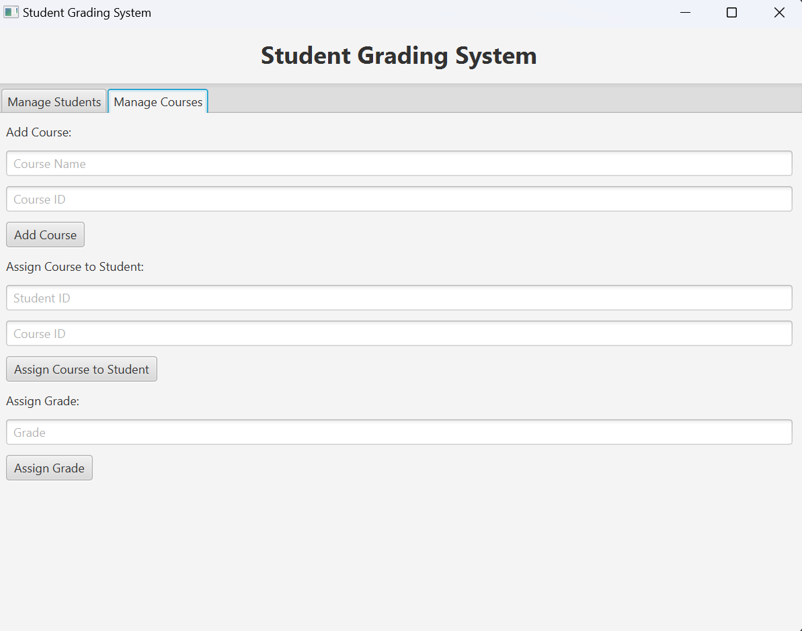
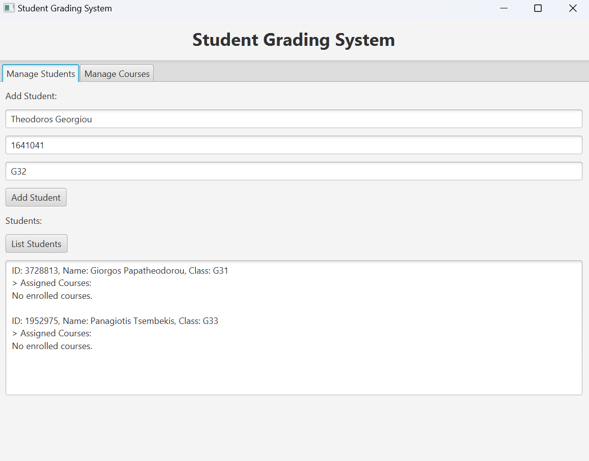
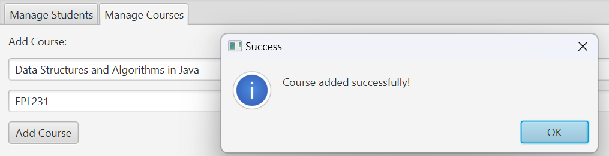
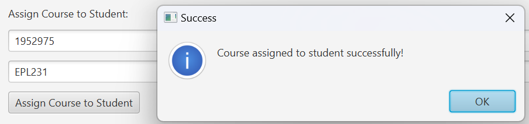

# 🧑‍🎓 Student Grading System

A comprehensive Java-based application that manages students, courses, and grades. This system allows users to add students and courses, assign students to courses, and assign grades to students. The application also provides a simple graphical user interface (GUI) built using JavaFX for easy interaction.

## 🛠️ Features

### ⭐ Current Features
1. **Student Management:**
   - Add new students by entering their name, ID, and class.
   - Update student's details (name, ID, class, remove enrolled courses and edit assigned grades).
   - Delete students.
   - View a list of all students and their enrolled courses, with grades.
   
2. **Course Management:**
   - Add new courses by specifying the course name and ID.
   - Assign students to courses.
   - Assign grades to students for courses they are enrolled in.
   
3. **Student-Course Relationship:**
   - View the courses a student is enrolled in and their corresponding grades.

4. **User Interface:**
   - Simple and intuitive GUI built using JavaFX.
   - Tabs for managing students and courses.
   - Alerts for successful or failed actions (e.g., adding students, assigning courses/grades).

### 🔜 Upcoming Features
1. **Advanced Reporting:**
   - Generate detailed reports for students, including average grades, course performance, etc.
   
2. **Grade Calculation Algorithms:**
   - Implement functionality for calculating final grades based on weighted assignments, exams, etc.
      
3. **User Authentication:**
   - Implement authentication to secure the application and allow multiple users (teachers, administrators, etc.).

4. **Data Persistence:**
   - Implement saving and loading of data, so that students, courses, and grades persist between application restarts.

5. **UI Improvement:**
   - Enhance the user interface for a more intuitive and responsive experience.
   - Implement dynamic feedback for actions (e.g., adding students, assigning courses).
   - Improve the layout for better accessibility and user navigation.


## Screenshots

### 1. **Manage Students Tab**
   This tab allows you to view and manage students. It displays the list of students and allows you to add new students to the system.

   

### 2. **Manage Courses Tab**
   The Manage Courses tab allows you to add new courses and view the details of existing courses.

   

### 3. **Add Student**
   This section shows the interface for adding a new student. You can enter the student's name, ID, and class details.

   

### 4. **Add Course**
   This section demonstrates how to add a new course, where you can enter the course name and ID.

   

### 5. **Assign Course to Student**
   This screenshot shows the screen where you can assign a course to a student by entering the student's ID and the course ID.

   

### 6. **Assign Course to Non-Existent Student**
   This section demonstrates the error message shown when trying to assign a course to a student who is not enrolled in the system.

   


## Demo Video

Watch the demo video below to see the Student Grading System in action:

<video controls width="500">
  <source src="assets/preview-video.mp4" type="video/mp4">
</video>


## Requirements

- **Java Version:** 21 or higher
- **JavaFX:** Required for the graphical user interface (GUI)
- **IDE:** Any Java IDE (e.g., IntelliJ IDEA, Eclipse, or VS Code)

## Setup

To run the project locally:

1. Clone the repository:
   ```bash
   git clone https://github.com/yourusername/student-grading-system.git
   ```

2. Navigate to the project directory:
   ```bash
   cd student-grading-system
   ```

3. Open the project in your preferred IDE.

4. Ensure you have JavaFX configured:
   - For IDE setup, ensure that JavaFX libraries are properly linked to your project.

5. Run the `StudentGradingSystemUI` class to start the application.

## Usage

- **Add a Student:**
  - Go to the "Manage Students" tab, fill in the student's name, ID, and class, and click "Add Student."
  
- **Add a Course:**
  - Go to the "Manage Courses" tab, fill in the course name and ID, and click "Add Course."

- **Assign a Student to a Course:**
  - In the "Manage Courses" tab, enter the student's ID and the course ID, then click "Assign Course to Student."

- **Assign a Grade:**
  - In the "Manage Courses" tab, enter the student's ID, course ID, and grade, then click "Assign Grade."

## Contributing

Feel free to fork the repository, submit issues, and create pull requests for improvements or bug fixes. Contributions are welcome!

<!-- ## License

This project is licensed under the MIT License - see the [LICENSE](LICENSE) file for details.

---

*Note:* This is a simple project and can be further expanded with more features like authentication, advanced reporting, and data persistence. Contributions and suggestions for new features are welcome! -->
