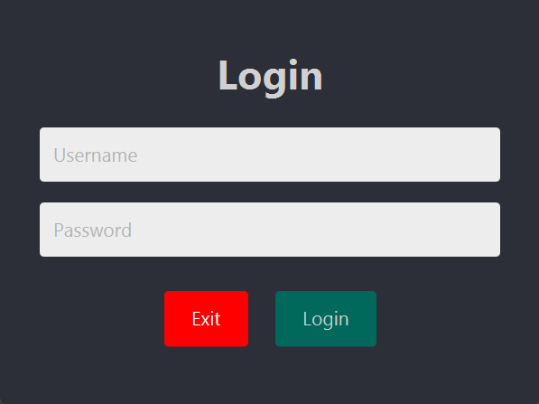
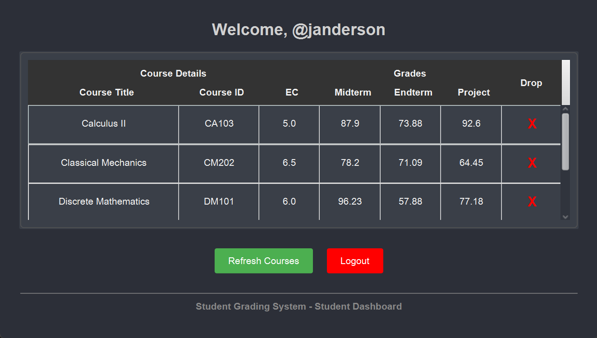
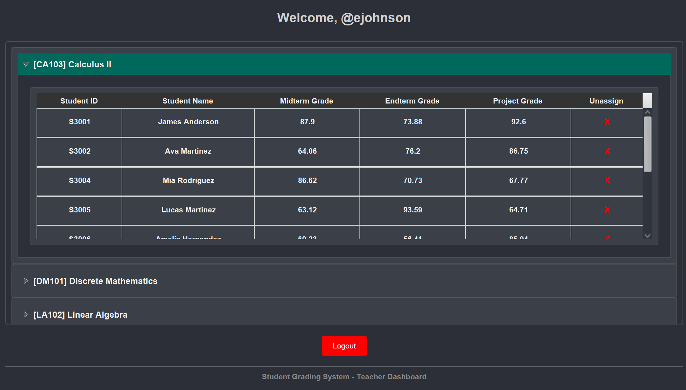
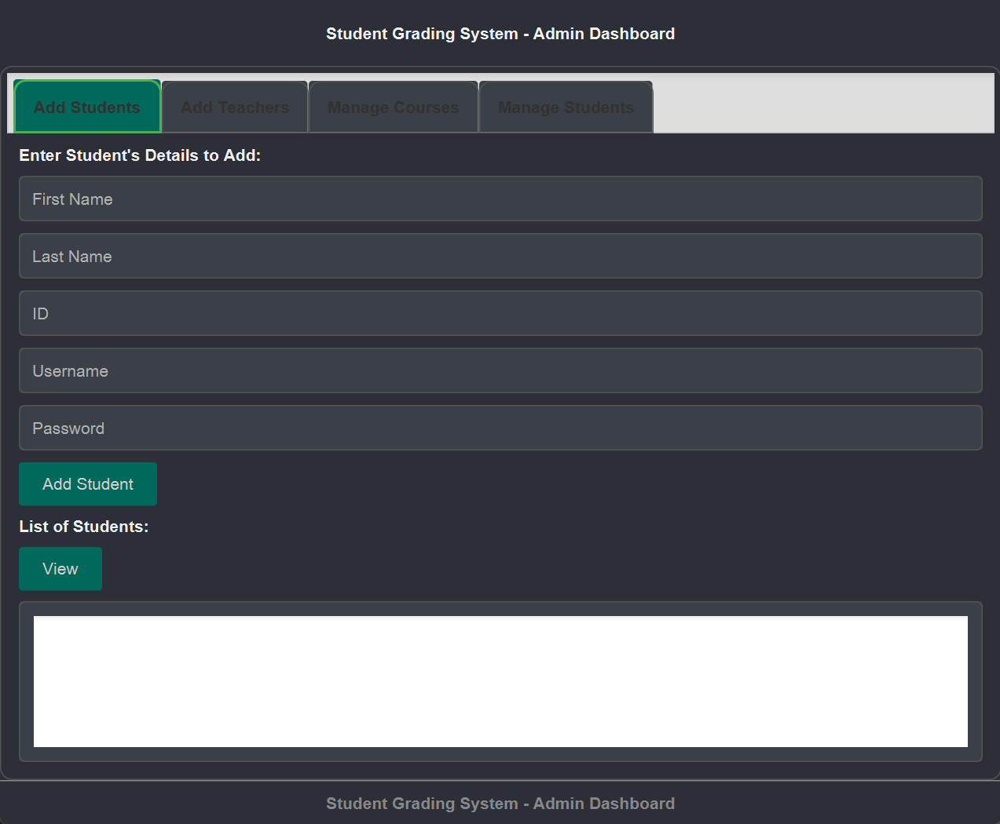

# 🧑‍🎓 Student Grading System

A Java-based student grading system with role-based authentication and MySQL integration. Users can manage students, courses, and grades through a modern JavaFX GUI with role-specific dashboards.

## 🛠️ Features

### ⭐ Current Features
1. **Role-Based Authentication:**
   - Secure login for **Admin**, **Teacher**, and **Student** users.
   - Each role has access to specific features based on permissions.

2. **Student Management (Admin Only):**
   - Add new students by entering their name, ID, and class.
   - Update student details (name, ID, class).
   - Remove students from the system.
   - Assign courses and grades to students.
   - View all students and their enrolled courses with grades.

3. **Teacher Management (Admin Only):**
   - Add and remove teachers.
   - Assign courses to teachers.
   - Manage teacher accounts.

4. **Course Management:**
   - Add and remove courses. (Αdmin Only)
   - Assign students to courses (Admin only).
   - Assign and edit grades for students in their courses. (Admin & Teacher)
   - Remove students from their courses. (Admin, Teacher & Student)

5. **Student Features (Student Only):**
   - View personal courses and grades.
   - Drop courses.
   
6. **User Interface:**
   - Simple and intuitive GUI built using JavaFX.
   - **Role-based windows**:
     - Admin Dashboard
     - Teacher Dashboard
     - Student Dashboard
   - Tabs for managing students, courses, and teachers.
   - Alerts for successful or failed actions (e.g., adding students, assigning courses/grades).


## 🔑 Usage by Roles

**Login Screen Preview:**  


### 🎓 Student:
- View enrolled courses and assigned grades.
- Check personal academic progress.

**Student Dashboard Preview:**  


### 🧑‍🏫 Teacher:
- Assign and update student grades.
- Remove students from their courses.
- View assigned courses and enrolled students.

**Teacher Dashboard Preview:**  



### 👨‍💼 Admin:
- Add, edit, and remove students and teachers.
- Manage courses and assign them to teachers and students.
- Full control over courses, users, and grades.

**Admin Dashboard Preview (Buggy Tab Header Styling - Upcoming Fix)**  



## 🎥 Demo Videos

- **Student Interface Preview:**  
  [](https://www.youtube.com/watch?v=ZJqXoP3K3uU&list=PLcBZ1qLPGrV2LztfPFz9k5JzIsLqBucF4&ab_channel=PanagiotisTsembekis)

- **Teacher Interface Preview:**  
  [](https://www.youtube.com/watch?v=YKvESa6d8vU&list=PLcBZ1qLPGrV2LztfPFz9k5JzIsLqBucF4&index=2&ab_channel=PanagiotisTsembekis)


## Requirements

- **Java Version:** 21 or higher
- **JavaFX:** Required for the graphical user interface (GUI)
- **IDE:** Any Java IDE (e.g., IntelliJ IDEA, Eclipse, or VS Code)

## Setup

To run the project locally:

1. Clone the repository:
   ```bash
   git clone https://github.com/yourusername/student-grading-system.git
   ```

2. Navigate to the project directory:
   ```bash
   cd student-grading-system
   ```

3. Open the project in your preferred IDE.

4. Ensure you have JavaFX configured:
   - For IDE setup, ensure that JavaFX libraries are properly linked to your project.

5. Run the `StudentGradingSystemUI` class to start the application.

## Contributing

Feel free to fork the repository, submit issues, and create pull requests for improvements or bug fixes. Contributions are welcome!